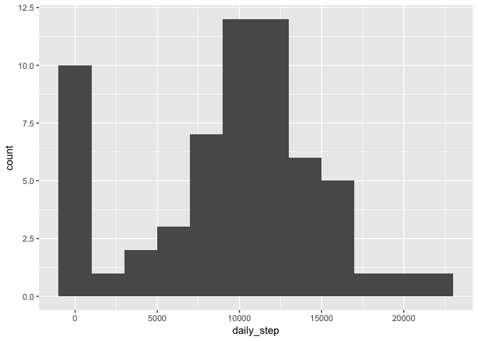
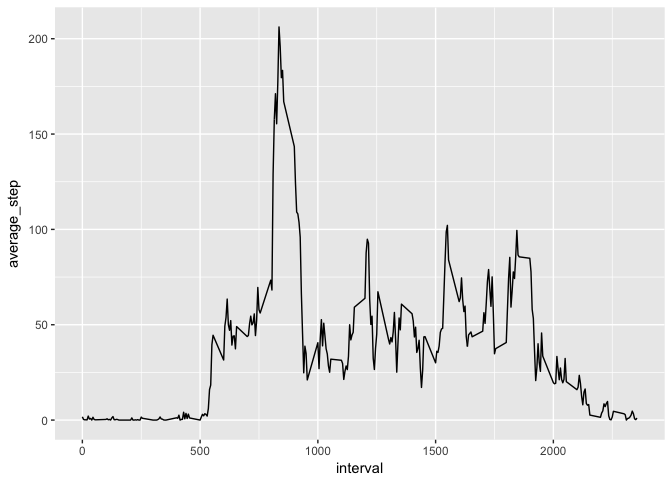
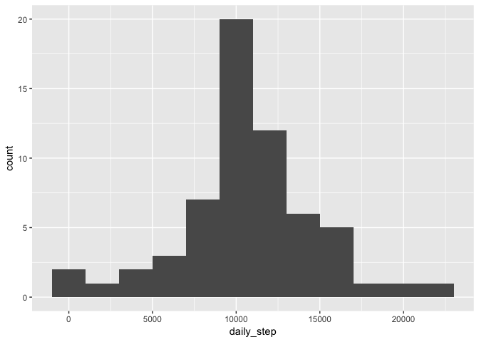
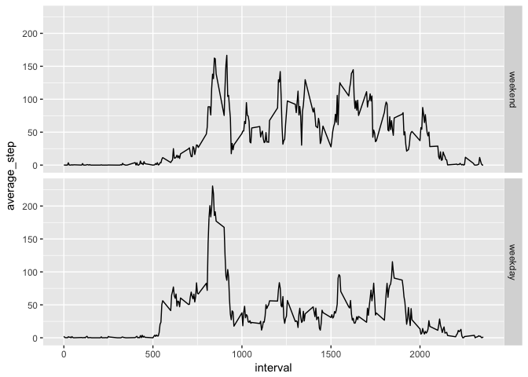

```r
suppressMessages(library(tidyverse))
suppressMessages(library(lubridate))
library(knitr)
```

## Loading and preprocessing the data


```r
if (!file.exists("./data")) {
    dir.create("./data")
}

if (!file.exists("./activity.zip")) {
    fileURL <- "https://d396qusza40orc.cloudfront.net/repdata%2Fdata%2Factivity.zip"
    download.file(fileURL, destFile = "./activity.zip", method = "curl")
}

if (!file.exists("./data/activity.csv")) {
    unzip("./activity.zip", exdir = "./data", overwrite = TRUE)
}

activity <- read_csv(
    "./data/activity.csv",
    col_types = cols(
        steps = col_integer(),
        date = col_date(format = "%Y-%m-%d"),
        interval = col_integer()
        )
    )
```

Dataset variables:

* **steps**: Number of steps taking in a 5-minute interval (missing values are coded as `NA`)
* **date**: The date on which the measurement was taken in `YYYY-MM-DD` format
* **interval**: Identifier for the 5-minute interval in which measurement was taken


```r
str(activity)
```

```
## Classes 'tbl_df', 'tbl' and 'data.frame':	17568 obs. of  3 variables:
##  $ steps   : int  NA NA NA NA NA NA NA NA NA NA ...
##  $ date    : Date, format: "2012-10-01" "2012-10-01" ...
##  $ interval: int  0 5 10 15 20 25 30 35 40 45 ...
##  - attr(*, "spec")=List of 2
##   ..$ cols   :List of 3
##   .. ..$ steps   : list()
##   .. .. ..- attr(*, "class")= chr  "collector_integer" "collector"
##   .. ..$ date    :List of 1
##   .. .. ..$ format: chr "%Y-%m-%d"
##   .. .. ..- attr(*, "class")= chr  "collector_date" "collector"
##   .. ..$ interval: list()
##   .. .. ..- attr(*, "class")= chr  "collector_integer" "collector"
##   ..$ default: list()
##   .. ..- attr(*, "class")= chr  "collector_guess" "collector"
##   ..- attr(*, "class")= chr "col_spec"
```

## What is mean total number of steps taken per day?


```r
sum_activity <- activity %>%
    group_by(date) %>%
    summarize(daily_step = sum(steps, na.rm = TRUE))

qplot(daily_step, data = sum_activity, binwidth = 2000)
```

<!-- -->

```r
mean_step <- mean(sum_activity$daily_step, na.rm = TRUE)
median_step <- median(sum_activity$daily_step, na.rm = TRUE)
```

Daily step mean = 9,354.23  
Daily step median = 10,395

## What is the average daily activity pattern?


```r
avg_activity <- activity %>%
    group_by(interval) %>%
    summarize(average_step = mean(steps, na.rm = TRUE))

qplot(interval, average_step, data = avg_activity, geom = "line")
```

<!-- -->

```r
max_index <- which.max(avg_activity$average_step)
max_interval <- avg_activity$interval[max_index]
max_step <- avg_activity$average_step[max_index]
```

Interval with maximum value = 835  
Maximum average step value = 206.1698

## Imputing missing values


```r
missing_values <- sum(is.na(activity$steps))
```

Total number of missing step values = 2,304

### Strategy to replace missing values
Replace `NA` with 5-minute interval average across all days


```r
impute_activity <- activity %>%
    mutate(steps = ifelse(is.na(steps),
                          avg_activity$average_step[match(avg_activity$interval,interval)],
                          steps)
           )

sum_impute_activity <- impute_activity %>%
    group_by(date) %>%
    summarize(daily_step = sum(steps, na.rm = TRUE))

qplot(daily_step, data = sum_impute_activity, binwidth = 2000)
```

<!-- -->

```r
imputed_mean_step <- mean(sum_impute_activity$daily_step, na.rm = TRUE)
imputed_median_step <- median(sum_impute_activity$daily_step, na.rm = TRUE)
```


```r
sum_table <- data.frame(Mean = c(mean_step, imputed_mean_step),
                        Median = c(median_step, imputed_median_step),
                        row.names = c("Original", "Imputed")
                        )

kable(sum_table,
      format = "html",
      align = "r",
      format.args = list(big.mark = ','),
      table.attr = "style='width:30%;'",
      caption = "Compare mean daily step counts"
      )
```

<table style='width:30%;'>
<caption>Compare mean daily step counts</caption>
 <thead>
  <tr>
   <th style="text-align:left;">   </th>
   <th style="text-align:right;"> Mean </th>
   <th style="text-align:right;"> Median </th>
  </tr>
 </thead>
<tbody>
  <tr>
   <td style="text-align:left;"> Original </td>
   <td style="text-align:right;"> 9,354.23 </td>
   <td style="text-align:right;"> 10,395.00 </td>
  </tr>
  <tr>
   <td style="text-align:left;"> Imputed </td>
   <td style="text-align:right;"> 10,766.19 </td>
   <td style="text-align:right;"> 10,766.19 </td>
  </tr>
</tbody>
</table>

## Are there differences in activity patterns between weekdays and weekends?


```r
impute_activity <- impute_activity %>%
    mutate(dayname = wday(date, label = TRUE),
           weekday = factor((dayname %in% c("Mon", "Tue", "Wed", "Thu", "Fri")),
                            levels = c(FALSE, TRUE), labels = c("weekend", "weekday"))
           )

avg_impute_activity <- impute_activity %>%
    group_by(interval, weekday) %>%
    summarize(average_step = mean(steps, na.rm = TRUE))

qplot(interval, average_step, facets = weekday ~ ., data = avg_impute_activity, geom = "line")
```

<!-- -->
